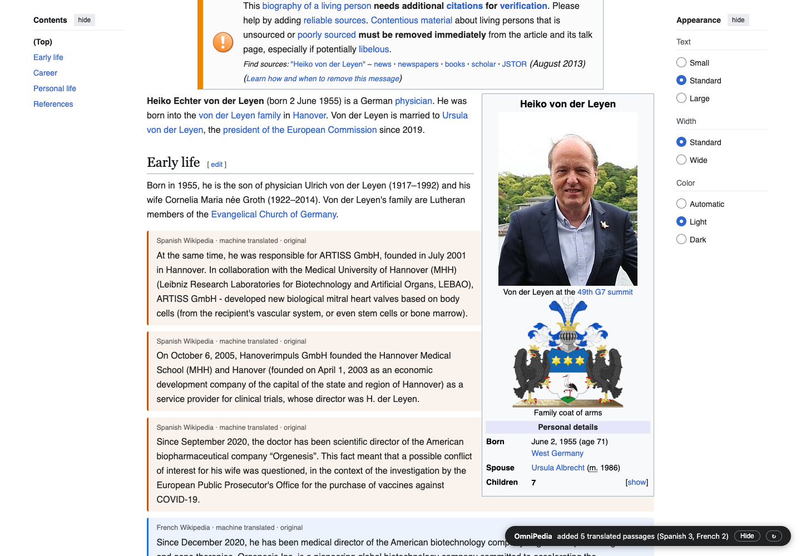

# OmniPedia

A Chrome/Brave extension that completes English Wikipedia articles.

 On any English article it finds the same article in other language editions, machine-translates their content, keeps only the passages whose information the English page does not have, and injects those passages inline — each one colour-coded by language, labelled "machine translated", and linked to its original. The whole pipeline runs automatically when an article loads.

Example: on `en.wikipedia.org/wiki/Heiko_von_der_Leyen` it adds the ARTISS GmbH founding, the Hannover clinical-trials directorship, and the Orgenesis conflict-of-interest context from the Spanish and French editions — none of which the English article mentions.

## Install (Brave or Chrome)

1. `git clone https://github.com/SAL-9000-LTD/omnipedia.git` (or download and unzip the repo).
2. Open `brave://extensions` (or `chrome://extensions`).
3. Turn on "Developer mode" (top right).
4. Click "Load unpacked" and choose the cloned folder.
5. Open any English Wikipedia article. The pill in the bottom-right corner shows progress and results.

## Using it

- **Pill** (bottom right): live status, result summary, Hide/Show for the injected blocks, and a re-run button that ignores the cache.
- **Popup** (toolbar icon): auto-run toggle, max languages (default 5), novelty threshold (higher injects more), run/re-run buttons, clear cache.
- Injected blocks sit at the end of the matching English section; material with no matching section goes into "Additional information from other language editions" placed before References.

## How it works

1. Query the article's language links, then each linked edition's size; rank by size and take the top N above a 2,000-byte floor. The deep edition can be any language — for Heiko von der Leyen it is Spanish, not German.
2. Fetch each chosen edition's Parsoid HTML and extract paragraphs and list items (tables, infoboxes, references and navigation are skipped).
3. Translate section headings, match them to English sections via a canonical-heading synonym map; translate content in batches.
4. Score each translated passage against a token index of the whole English page (prose plus infobox): a passage is injected when most of its content words are absent, or when it is on-topic but carries mostly new numbers and dates. Accepted passages join the index, so the same fact arriving from a second language is not injected twice.
5. Results are cached per article keyed on every edition's revision id, so revisits are instant and edits anywhere invalidate cleanly.

Translation uses the browser's on-device Translator API when a language pack is available (Chrome 138+), otherwise Google's free web translate endpoint. On the web path, article text is sent to Google. The endpoint is unofficial; if it ever breaks, the pill reports the failure and the page is simply left unmodified.

## Development

- `npm test` — unit tests for the scoring/matching/parsing core (`content/lib.js`).
- `npm run smoke` — full end-to-end run: loads the extension into Playwright's Chrome for Testing, drives the live Heiko von der Leyen article, asserts injected blocks and cache replay, screenshots to `smoke/last-run.png`. Pass a different article URL as an argument; set `OMNI_CHROME` to a browser binary (verified against Brave), `OMNI_HEADED=1` to watch.

Layout: `background.js` (fetch proxy + batch translator; note the endpoint requires `client`/`sl`/`tl` as query parameters — in the POST body it returns 405), `content/lib.js` (pure logic, node-testable), `content/wiki.js` (API + extraction), `content/translate.js` (engine selection), `content/inject.js` (DOM/UI), `content/main.js` (orchestrator, per-language 150s watchdog, 60-candidate cap), `popup/`.

## Known limits (v1)

- Section-level placement: a passage lands at the end of the best-matching section, which can put career detail under "Early life" when the source edition keeps one big "Biography" section.
- Machine translation quality is what it is; occasional garbled sentences come straight from the translator.
- Infoboxes and tables in foreign editions are not mined yet (the English infobox does feed the coverage index).
- English Wikipedia only as the target; desktop site only.

## License

MIT — see [LICENSE](LICENSE). Injected article content comes from Wikipedia and remains [CC BY-SA](https://creativecommons.org/licenses/by-sa/4.0/); every injected block links to its source article.

Built by [SAL-9000 Ltd](https://sal-9000.com), makers of [Paster](https://sal-9000.com/paster).
